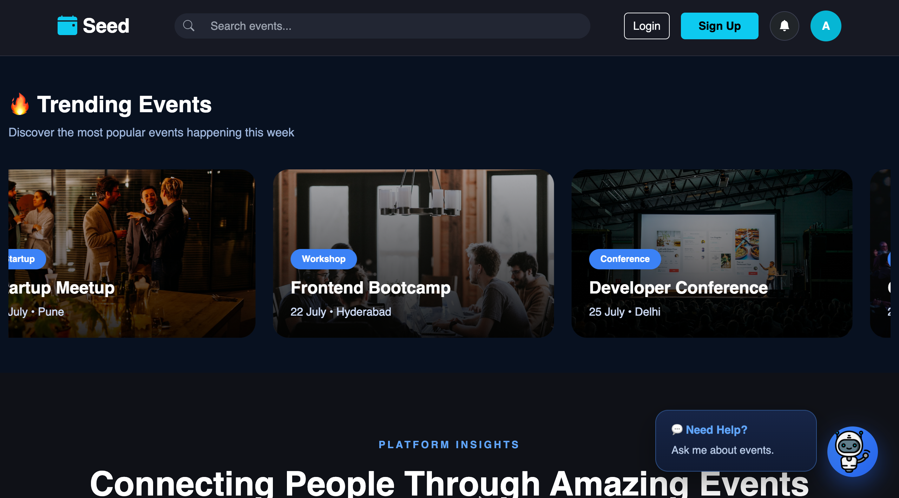
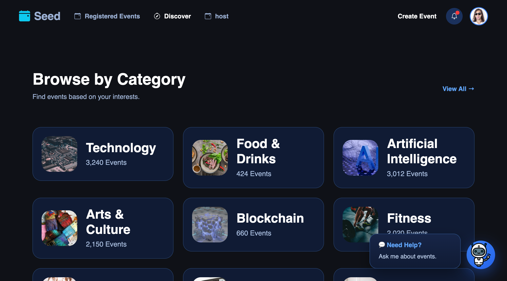

<div align="center">

# 🌱 Seed - Event Listing & Registration Platform

### Discover • Explore • Register • Organize Events

A modern and responsive Event Listing Platform built using **HTML, CSS, JavaScript, and Bootstrap**. Seed allows users to discover trending events, browse by category, register for events, manage registrations, and interact with an intelligent chatbot for event recommendations.


</div>

---

# 📖 Overview

Seed is a frontend event management platform where users can browse upcoming events, search events, register for them, explore categories, and interact with an integrated chatbot.

The project follows a clean folder structure by separating **Admin**, **User**, **Chatbot**, **CSS**, **JavaScript**, and **HTML** modules.

---

# ✨ Features

## 👥 User Features

- 🔍 Search Events
- 🎉 Browse Trending Events
- 📂 Browse Events by Category
- 📍 Explore Events
- 📅 Register for Events
- 📋 View Registered Events
- 🤖 AI-like Chatbot
- 🔔 Notification Icon
- 👤 User Profile
- 📱 Responsive Design

---

## 🛠 Admin Features

- ➕ Create Events
- 📝 Manage Events
- 📊 Organizer Dashboard
- 👨‍💼 Event Management Interface

---

## 🤖 Chatbot Features

- Interactive chat interface
- Event recommendations
- Category-based suggestions
- Quick reply buttons
- Modern messaging UI
- Auto responses using JavaScript

---

# 🖼 Project Preview

## 🏠 Homepage



---

## 🤖 Chatbot


---

## 📂 Browse Categories




---

## 📈 Platform Insights

- 10,000+ Events
- 250K+ Happy Attendees
- 120+ Cities Covered

---

# 📁 Project Structure

```
Seed/
│
├── Admin/
│   ├── createEvent.html
│   ├── manage-events.html
│   └── organisers-dashboard.html
│
├── chatbot/
│   ├── chatbot.css
│   ├── chatbot.js
│   └── chatData.js
│
├── css/
│   ├── style.css
│   ├── login.css
│   └── signup.css
│
├── html/
│   ├── index.html
│   ├── login.html
│   └── signup.html
│
├── js/
│   ├── script.js
│   ├── login.js
│   └── signup.js
│
├── User/
│   ├── css/
│   ├── html/
│   └── js/
│
└── README.md
```

---

# 🚀 Pages

### Authentication

- Home
- Login
- Signup

### User

- Homepage
- Registered Upcoming Events
- Registered Past Events

### Admin

- Organizer Dashboard
- Manage Events
- Create Event

---

# 🎯 Functionalities

✅ Search Events

✅ Browse Categories

✅ Register Events

✅ Responsive Navigation

✅ Event Statistics

✅ Chatbot Assistant

✅ Admin Dashboard

✅ Event Management

---

# 🛠 Tech Stack

| Technology | Usage |
|------------|-------|
| HTML5 | Structure |
| CSS3 | Styling |
| Bootstrap 5 | Responsive Layout |
| JavaScript | Functionality |
| Bootstrap Icons | Icons |

---

# 💻 Getting Started

Clone the repository

```bash
git clone https://github.com/akashWakade7355/LeapX-Project-4.git
```

Open project

```bash
cd Seed
```

Run

Simply open

```
html/index.html
```

or use VS Code Live Server.

---

# 📱 Responsive Design

The website is optimized for

- Desktop
- Laptop
- Tablet
- Mobile

---

# 🌟 Future Improvements

- Backend Integration
- Database Support
- Payment Gateway
- Email Notifications
- Dark / Light Theme
- Real AI Chatbot Integration
- Event Favorites

---

# 🤝 Contributing

Contributions are always welcome.

1. Fork the repository

2. Create a new branch

```bash
git checkout -b feature-name
```

3. Commit your changes

```bash
git commit -m "Added new feature"
```

4. Push

```bash
git push origin feature-name
```

5. Open a Pull Request

---

# ⭐ Support

If you found this project helpful,

⭐ Star the repository

🍴 Fork it

📢 Share it with others

---

<div align="center">

### 🌱 Built with HTML, CSS, JavaScript & Bootstrap


</div>